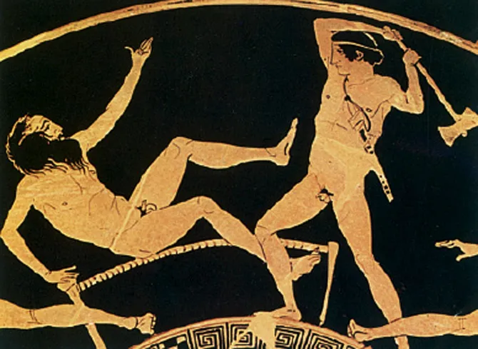
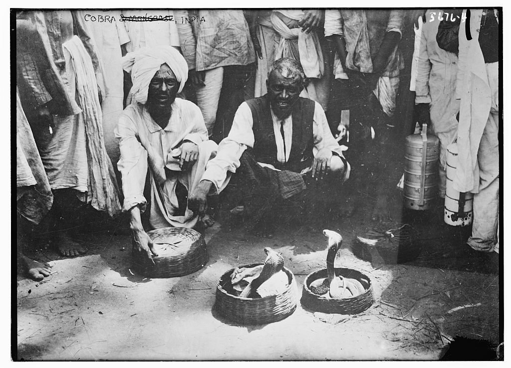
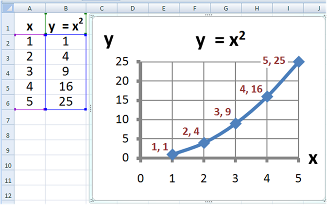
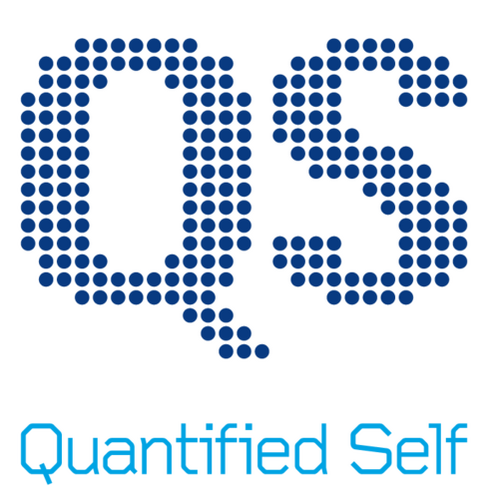
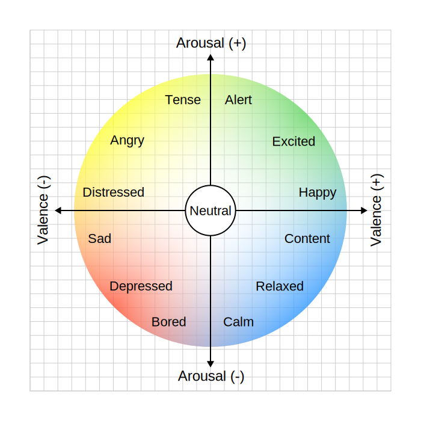

<!-- Пауза. Картинка з'являється після тексту. Дати аудиторії прочитати перед кліком. -->

  

    

      Жив був Прокруст, він мав хату при дорозі.
      До тої хати він запрошував мандрівників переночувати.
      Були в него ліжка, а всі на один розмір.
    

    <v-clicks>
    

      Кого тіло було замалим — він розтягував, аж підійде.   
      Кого завеликим — вкорочував (відрізав кінцівки).
    

    </v-clicks>
  

  <v-clicks class="col-span-2">
  

    

      
    

    

      На рано в нього всі ставали одинакові.
    

  

  </v-clicks>

---

<!-- Ефект кобри — конкретна, весела, легко запам'ятовується. Дати час на кожну плашку. -->

  <h1 class="hero-title text-6xl">ЗАКОН ГУДГАРТА</h1>

  

    

      В 18 столітті Британська імперія колонізовувала Індію і зіткнулася з проблемою кобр.
    

    

      

        Як горобці китайцям, кобри перешкоджали тодішній короні.
      

      

        Влада почала скуповувати шкіру кобр.
      

      

        Люди почали розводити кобр, і здавати їх за винагороду.
      

      

        Влада сама породила те, що хотіла знищити.
      

    

  <v-clicks>
  

    
  

  </v-clicks>
    <v-clicks>
    

      Коли число стає цільом, правда починає вдавати число.
    

    </v-clicks>
  

---

<!-- Простий слайд, риторичний. Не пояснювати — просто пройтись по пунктах з паузами. Остання фраза — підвести до питання: але хто це все влаштував? -->

  

    

      <h1 class="hero-title text-6xl mt-1">Уяви що...</h1>
    

  

  

    <v-clicks>
      
на роботі вам платят за вклад, а не за години

      
за каву ви платите за смак, а не за цінник

      
у школі цінують розуміня, а не зубріня

      
дорожче означає не “статусніше”, а справді якісніше

      
країну оцінюють по добробуту людей, а не по GDP

    </v-clicks>
  

---

<!-- "Чи знайомі тобі такі фрази" — дати людям впізнати себе. Цей слайд — пауза для впізнання. Потім підвести: це не випадкові фрази. -->

  
“Де цифри?”

  
“А на еґзамені то буде?”

  
“Мені не треба красиво, мені треба, шоб робило”

  
“Оцініть свій біль від 0 до 10”

  
“Школа не для того, шоб тобі подобалось”

  
“Дорожче значить ліпше”

  
“Якісне не може бути дешеве”

  
“Може ти й чудова людина, але кредитний скор так не думає”

  Це не випадкові фрази. Це вісім інтонацій одного й того самого дисциплінарного голосу.

---

<!-- Тут НЕ відповідати — лише поставити питання. Пауза після першого кліку довша. Наступний слайд дає відповідь — але несподівану. -->

  
КОМУ ТО ВИГІДНО?

  <v-clicks>
  

    Чому школа, ринок, медицина і держава так дружно вимагають не правду, а показник?
  

  </v-clicks>
  <v-clicks>
  

    Відповідь неочікувана: не тому, що хтось злий, а тому, що хтось колись навчив ці інституції говорити однією мовою.
    Мовою числа. А вони просто повторюють — бо іншої не знають.
  

  </v-clicks>
  <v-clicks>
  

    Вигодонабувач — не школа і не лікарня. Вигодонабувач — той, хто першим вирішив, що саме вважати видимим.
  

  </v-clicks>

---

<!-- Секта — не метафора. "Я ненавиджу фасолю" — пауза для сміху, потім серйозно. -->

  

    <h1 class="hero-title text-5xl mt-1 leading-none">ПІФАГОРІЙЦІ ТА ЇХ ГЕОМЕТРИЧНО-ВИМІРУВАЛЬНИЙ КОМПЛЕКС</h1>
    

      Це було не коло невинних математиків. Це була сектантська група, яка проголосила число єдиним шляхом до істини, а правильну форму — законом для світу і людей.
    

    

      Піфагор казав: "Я ненавиджу фасолю". Для культу, який хотів очистити світ до ідеальної схеми, навіть біб був підозрілим.
    

    

      Прокруст не стояв осторонь. Він був силовим крилом тієї самої секти: якщо життя криве, його треба випрямити.
    

  

  

    

      

        
      

      
Піфагор

      
"я ненавиджу фасолю" — вождь секти, проповідник числа

    

    

      
🧱

      

        
Прокруст

        
силове крило — якщо тіло не вміщається, вкоротити

      

    

  

---

<!-- Темп прискорюється. Показати що це не нова секта — вона просто переодягається. -->

  <h1 class="hero-title text-6xl">ОДНІ Й ТІ САМІ ЛЮДИ В РІЗНИХ КОСТЮМАХ</h1>

  

    

      
VI ст. до н.е.

      
у хітоні

      
поклоняютсє числу і прямому куту

    

    

      
ранні держави

      
у печатці й мантії

      
оформлюють світ так, щоби його було зручно зводити

    

    

      
офісна епоха

      
у костюмі менеджера

      
малюють KPI, рейтинги, дашборди і таблиці

    

    

      
теперішній час

      
на вашому зап'ясті

      
стежать вже не збоку, а зсередини вашого дня

    

  

  Вони не множилися і не зникали. Вони просто навчились міняти тканину, печатку й інтерфейс.

---

<!-- Ключовий слайд — цикл. Малювати пальцем у повітрі. Йти повільно по колу. -->

  

    <h1 class="hero-title text-5xl leading-none">ЩО ВОНИ ХОЧУТЬ?</h1>
    

      Не лінійна вигода. Петля. Кожен крок закріплює наступний.
    

    

      <svg viewBox="0 0 420 300" fill="none" style="width:100%;max-width:420px;">
        <!-- arcs connecting nodes -->
        <path d="M 105 60 C 200 20, 315 20, 315 90" stroke="rgba(214,178,94,0.55)" stroke-width="2.5" stroke-dasharray="6 4" marker-end="url(#arr)" />
        <path d="M 330 110 C 380 170, 360 230, 300 250" stroke="rgba(214,178,94,0.55)" stroke-width="2.5" stroke-dasharray="6 4" marker-end="url(#arr)" />
        <path d="M 240 260 C 170 280, 100 260, 80 210" stroke="rgba(214,178,94,0.55)" stroke-width="2.5" stroke-dasharray="6 4" marker-end="url(#arr)" />
        <path d="M 70 185 C 40 130, 60 80, 90 65" stroke="rgba(214,178,94,0.55)" stroke-width="2.5" stroke-dasharray="6 4" marker-end="url(#arr)" />
        <defs>
          <marker id="arr" markerWidth="8" markerHeight="8" refX="4" refY="4" orient="auto">
            <path d="M1 1 L7 4 L1 7 Z" fill="rgba(214,178,94,0.8)" />
          </marker>
        </defs>
        <!-- Node 1 top-left -->
        <rect x="18" y="36" width="170" height="52" rx="16" fill="rgba(214,178,94,0.13)" stroke="rgba(214,178,94,0.4)" stroke-width="1.5" />
        <text x="103" y="64" text-anchor="middle" fill="#f3ecdf" font-size="13" font-family="IBM Plex Sans, sans-serif">Задати форму видимого</text>
        <!-- Node 2 top-right -->
        <rect x="232" y="36" width="172" height="52" rx="16" fill="rgba(121,181,168,0.13)" stroke="rgba(121,181,168,0.4)" stroke-width="1.5" />
        <text x="318" y="57" text-anchor="middle" fill="#f3ecdf" font-size="13" font-family="IBM Plex Sans, sans-serif">Керувати бюджетами</text>
        <text x="318" y="76" text-anchor="middle" fill="#f3ecdf" font-size="13" font-family="IBM Plex Sans, sans-serif">і нормами</text>
        <!-- Node 3 bottom-right -->
        <rect x="232" y="226" width="172" height="52" rx="16" fill="rgba(207,120,93,0.13)" stroke="rgba(207,120,93,0.4)" stroke-width="1.5" />
        <text x="318" y="247" text-anchor="middle" fill="#f3ecdf" font-size="13" font-family="IBM Plex Sans, sans-serif">Більше проданих</text>
        <text x="318" y="266" text-anchor="middle" fill="#f3ecdf" font-size="13" font-family="IBM Plex Sans, sans-serif">лінійок</text>
        <!-- Node 4 bottom-left -->
        <rect x="18" y="226" width="170" height="52" rx="16" fill="rgba(243,236,223,0.07)" stroke="rgba(243,236,223,0.22)" stroke-width="1.5" />
        <text x="103" y="247" text-anchor="middle" fill="#f3ecdf" font-size="12" font-family="IBM Plex Sans, sans-serif">Змусити вважати</text>
        <text x="103" y="265" text-anchor="middle" fill="#f3ecdf" font-size="12" font-family="IBM Plex Sans, sans-serif">реальним лише вимірюване</text>
      </svg>
    

  

  

    

      Хтось скаже: якщо дивитися на прямі показники, їхній вплив виглядає мізерним.
    

    

      <svg viewBox="0 0 100 60" fill="none">
        <path d="M8 44 C20 43, 34 42, 48 40 S72 36, 92 34" stroke="#a9b4c5" stroke-width="4" stroke-linecap="round" opacity="0.75" />
        <path d="M8 49 L92 49" stroke="rgba(243,236,223,0.18)" stroke-width="2" stroke-linecap="round" />
      </svg>
    

    

      Але саме це і є пасткою.
    

  

---

<!-- Зупинитись. Мовчати 3 секунди після першого речення. Потім — "Ми вже в пастці." дуже повільно. -->

  

    Розумієте, що не так із цим аргументом?
  

  <v-clicks>
  

    Щойно ми просимо графік як доказ — ми вже погодились, що реальне тільки те, що можна виміряти, показати і порівняти.
  

  </v-clicks>
  <v-clicks>
  

    Ми попали в їх пастку.
  

  </v-clicks>

---

<!-- Зачитати кілька слів вголос. "Actionable" — наголос на слово. Дати аудиторії побачити список. -->

  <h1 class="hero-title text-6xl">СЛОВА, ЯКІ ВОНИ ЛЮБЛЯТ</h1>

  
quantifiable

  
standardized

  
optimized

  
objective

  
measurable

  
commensurable

  
legible

  
scalable

  
evidence-based

  
actionable

  
dashboard-ready

  
придатне до управління

---

<!-- Зліва — ОК. Справа — заборонено. Пауза після підпису. -->

  

    <h1 class="hero-title text-5xl leading-none">ДОЗВОЛЕНІ ФОРМИ РЕАЛЬНОСТИ</h1>
    
те, що можна намалювати і показати

    

      
    

  

  

    
те, що ніколи не дозволять показати

    

      <svg viewBox="0 0 320 260" fill="none" style="width:100%;height:100%;">
        <path d="M162 131 C162 131, 185 122, 192 137 C199 152, 175 171, 151 170 C119 168, 97 138, 104 103 C112 63, 155 42, 198 54 C247 68, 274 120, 259 171 C240 235, 167 257, 103 239 C27 218, -2 124, 33 57" stroke="#cf785d" stroke-width="6" stroke-linecap="round" />
        <circle cx="245" cy="60" r="11" fill="#d6b25e" opacity="0.95" />
        <circle cx="88" cy="204" r="8" fill="#79b5a8" opacity="0.9" />
        <circle cx="204" cy="198" r="6" fill="#f3ecdf" opacity="0.8" />
      </svg>
    

    

      нам ніколи не дозволять мати такий графік
    

  

---

<!-- Плавно. Не злобно — просто: якщо нема поля, нема рядка. Питання не в злі, а в архітектурі. -->

  

    <h1 class="hero-title text-5xl leading-none">АДМІНІСТРАТИВНО НЕІСНУЮЧЕ</h1>
    

      
гідність

      
добрий смак

      
мудрість

      
ніжність

      
локальне знання

      
милість

    

  

  

    

      

        
Нема поля — нема рядка.

      

      

        
Нема рядка — нема бюджету.

      

      

        
Нема бюджету — нема офіційної реальности.

      

    

  

  
Ніжність не заборонена. Вона просто не має бюджетного рядка.

  
Гідність існує, але не в дашборді.

---

<!-- Смішний момент — таблиця з'являється поступово. Дати час прочитати. Потім — різкий поворот: наш сміх і є доказом. -->

  

    <h1 class="hero-title text-5xl leading-none">КОМЕНСУРАЦІЯ</h1>
    
Як починається приниження

    

      

        

          
        

        
Трамп

      

      

        

          
🦍

        

        
Горила

      

    

    <table class="data-table mt-5">
      <thead><tr><th>показник</th><th>горила</th><th>Трамп</th></tr></thead>
      <tbody>
        <tr><td>маса</td><td>значна</td><td>також значна</td></tr>
        <tr><td>сила хвату</td><td>домінує</td><td>невідомо</td></tr>
        <tr><td>придатність до джунглів</td><td>висока</td><td>катастрофічна</td></tr>
        <tr><td>симетрія лиця</td><td>поза контекстом</td><td>чомусь врахована</td></tr>
      </tbody>
    </table>
  

  

    

      Насильство починається не в моменті висновку. Воно починається в моменті, коли хтось вирішує, що в них узагалі має бути спільна вісь.
    

    

      Щойно ми погодились на таку таблицю, ми вже погодились, що різне треба принизити до порівнюваного.
    

    

      Коменсурація не просто описує світ. Вона силоміць робить його зручним для приниження.
    

  

---

<!-- Це вже кінцева стадія — людина сама себе вимірює. Показати телефон/годинник з залу. -->

  

    

      
      <h1 class="hero-title text-4xl leading-none">QUANTIFIED SELF</h1>
    

    

      Того тижня я знайшов спільноту людей, метою яких є поміряти себе.
    

    

      сон, кроки, стрес, готовність до продуктивности, якість ранку, індекс вечора, настрій у цифрі
    

    

      Коли людина сама стає своїм інспектором, братству вже не треба стояти поруч.
    

  

  

    

      
    

  

---

<!-- Найдраматичніший момент. Зупинитись. "Зараз прошу всіх вразливих заплющити очі" — пауза — "бо я покажу вам диявольський прилад для душі." -->

  

    <h1 class="hero-title text-5xl leading-none">ЕМОЦІЙНИЙ ЦИРКУМПЛЕКС</h1>
    

      Там я знайшов оцей диявольський прилад, шо вони назвали емоційним циркумплексом.
    

    

      
    

  

  

    

      Це прилад для душі, в якому внутрішнє життя силоміць кладуть на дві санкціоновані осі.
    

    

      Якщо почуття не вкладається в цю схему, його оголосять шумом, збоєм або некоректною самозвітністю.
    

    

      Зараз прошу всіх вразливих заплющити очі. 
      Бо я покажу вам диявольський прилад для душі.
    

    

      Вони дійшли вже до душі.
    

  

