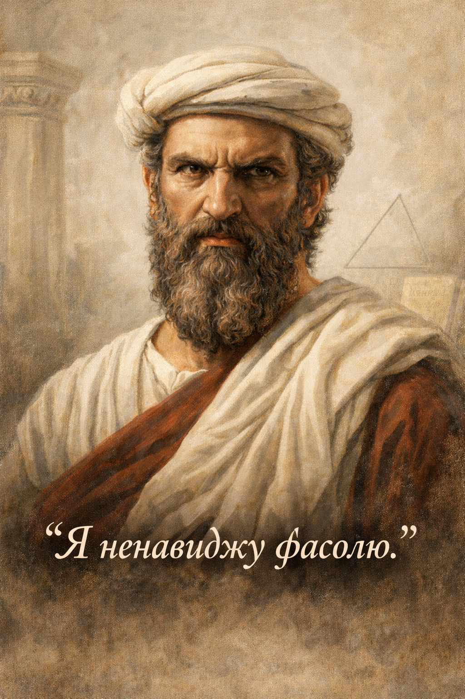
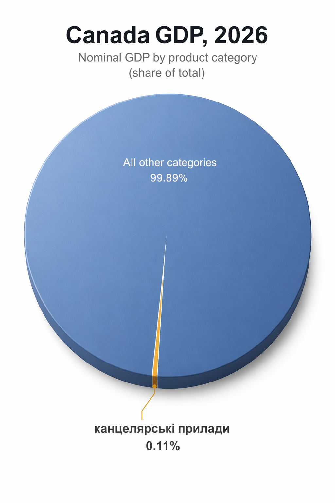
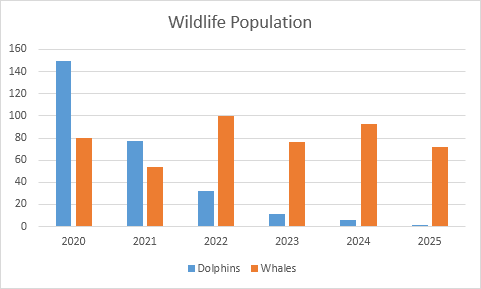
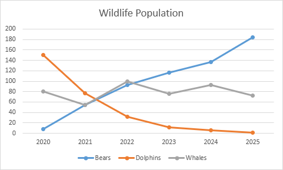
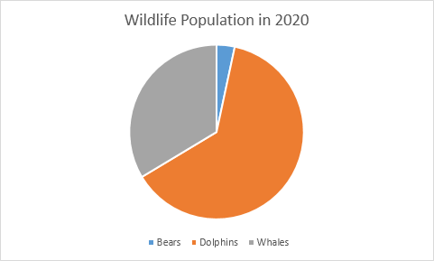
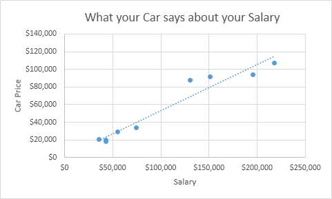
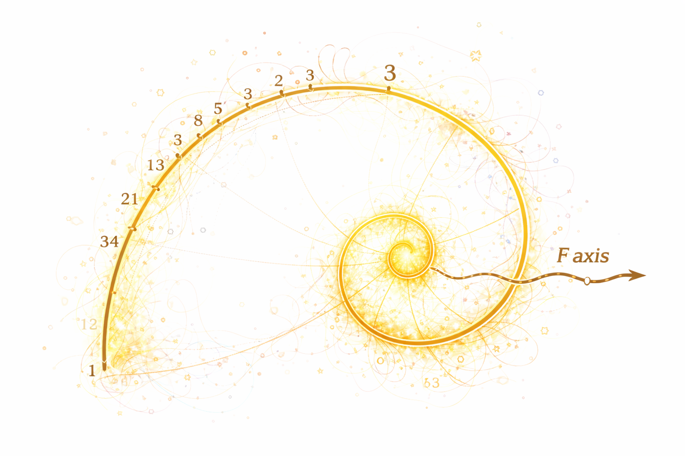

<!-- Пауза. Картинка з'являється після тексту. Дати аудиторії прочитати перед кліком. -->

  

    

      Жив був Прокруст, він мав хату при дорозі.
      До тої хати він запрошував мандрівників переночувати.
      Були в него ліжка, а всі на один розмір.
    

    <v-clicks>
    

      Кого тіло було замалим — він розтягував, аж підійде.   
      Кого завеликим — вкорочував (відрізав кінцівки).
    

    </v-clicks>
  

  <v-clicks class="col-span-2">
  

    

      
    

    

      На рано в нього всі ставали одинакові.
    

  

  </v-clicks>

---

<!-- Ефект кобри — конкретна, весела, легко запам'ятовується. Дати час на кожну плашку. -->

  

    

      В 18 столітті Британська імперія колонізовувала Індію і зіткнулася з проблемою кобр.
    

    

      
Кобри перешкоджали тодішній короні.

      
Влада почала скуповувати шкіру кобр.

      
Люди почали розводити кобр, і здавати їх за винагороду.

      
Вони самі породили те, що хотіли знищити.

    

  

  

    
  

---

<!-- Простий слайд, риторичний. Не пояснювати — просто пройтись по пунктах з паузами. Остання фраза — підвести до питання: але хто це все влаштував? -->

  

    <h1 class="hero-title text-6xl leading-none">Уяви що...</h1>
  

  

    <v-clicks>
      
на роботі тобі платять за вклад, а не за години

      
за каву ти платиш на стільки на скільки вона була смачна

      
в школі цінують твоє розуміння, а не зубріння

      
дорожче означає не "статусніше", а дісно якісніше

      
країну оцінюють по добробуту людей, а не по GDP

    </v-clicks>
  

---

<!-- "Чи знайомі тобі такі фрази" — дати людям впізнати себе. Цей слайд — пауза для впізнання. Потім підвести: це не випадкові фрази. -->

  
“Де цифри?”

  
“А на еґзамені то буде?”

  
“Мені не треба красиво, мені треба, шоб робило”

  
“Оцініть свій біль від 0 до 10”

  
“Школа не для того, шоб тобі подобалось”

  
“Дорожче значить ліпше”

  
“Якісне не може бути дешеве”

  
“Може ти й чудова людина, але кредитний скор так не думає”

<v-clicks>

  Чому ми хочемо одного, але говоримо за зовсім інче?

</v-clicks>

---

<!-- Не директор школи. Не міністр. Не лікар.
А той, хто навчив їх усіх одної й тої самої мови серйозности. -->

  
КОМУ ТО ВИГІДНО?

  <v-clicks>
  

    Хто вирішує що рахується, той вирішує що існує.
  

  </v-clicks>

---

<!-- Документальний тон. Без оцінок. Просто факти — хто вони такі. -->

  

    <h1 class="hero-title text-5xl mt-1 leading-none">ХТО ТАКІ ПІФАГОРІЙЦІ?</h1>
    

      VI ст. до н.е., Математик, містик, реформатор
      Піфагор заснував закриту спільноту — зо своїм статутом, ієрархією і таємним знанням.
    

     
    Їхнє кредо:
    

      Число — першопричина всього
    

    

      Правильна форма — не просто краса. Це модель, якій світ зобов'язаний коритись.
      Все, що відхиляється від форми, — не просто інакше. Воно неправильне.
    

  

  

    

      
    

    
~570–495 до н.е.

  

---

<!-- Зараз — сміх, але серйозно. Фасоля — це пуант. Після нього — Прокруст. -->

  

    <h1 class="hero-title text-5xl mt-1 leading-none">ОЗНАКИ СЕКТИ</h1>
    

      

        Жорсткий лідерський культ: слово Піфагора — закон  
      

      

        Заборони: не торкатись білого когута, не їсти з цілого хліба
      

      

        Очищення через математику: числа очищують душу  
      

      

        Нав'язлива любов до форми: правильна геометрія — правильний розум
      

    

  

  

    

      
    

  

---

<!-- Темп прискорюється. Показати що це не нова секта — вона просто переодягається. -->

  <h1 class="hero-title text-6xl">ГЕОМЕТРИЧНО-ВИМІРУВАЛЬНИЙ КОМПЛЕКС</h1>

  

    

      
VI ст. до н.е.

      
у хітоні

      
поклоняютсє числу і прямому куту

    

    

      
ранні держави

      
в мантії

      
оформлюють світ так, щоби його було зручно рахувати

    

    

      
офісна епоха

      
в смокінґу

      
малюють KPI, рейтинги, дашборди і таблиці

    

    

      
теперішній час

      
на вашому зап'ясті

      
стежать вже не збоку, а зсередини вашого дня

    

  

  Вони не множилися і не зникали. Вони просто <a style='color: var(--deck-danger)'>перевділись</a>.

---

<!-- Ключовий слайд — цикл. Говорити повільно, вголос по вузлах. Не коментувати — нехай сама петля говорить. -->

  <h1 class="hero-title text-5xl leading-none text-center">ЩО ВОНИ ХОЧУТЬ?</h1>
  

    <svg viewBox="0 0 520 370" fill="none" style="max-height:100%;width:auto;max-width:88%;">
      <defs>
        <marker id="cw" markerWidth="10" markerHeight="8" refX="9" refY="4" orient="auto">
          <path d="M0 0 L10 4 L0 8 Z" fill="rgba(214,178,94,0.95)"/>
        </marker>
      </defs>
      <text x="260" y="196" text-anchor="middle" fill="rgba(243,236,223,0.28)" style="font-size:12px;">замкнуте</text>
      <text x="260" y="214" text-anchor="middle" fill="rgba(243,236,223,0.28)" style="font-size:12px;">коло</text>
      <!-- T→R -->
      <path d="M 400 84 Q 506 172 438 254" stroke="rgba(214,178,94,0.65)" stroke-width="2.5" stroke-dasharray="8 5" fill="none" marker-end="url(#cw)"/>
      <!-- R→L -->
      <path d="M 344 292 Q 260 348 176 292" stroke="rgba(214,178,94,0.65)" stroke-width="2.5" stroke-dasharray="8 5" fill="none" marker-end="url(#cw)"/>
      <!-- L→T -->
      <path d="M 94 254 Q 14 168 148 84" stroke="rgba(214,178,94,0.65)" stroke-width="2.5" stroke-dasharray="8 5" fill="none" marker-end="url(#cw)"/>
      <!-- Top box -->
      <rect x="112" y="16" width="296" height="78" rx="14" fill="rgba(243,236,223,0.07)" stroke="rgba(243,236,223,0.25)" stroke-width="1.5"/>
      <text x="260" y="40" text-anchor="middle" fill="#f3ecdf" style="font-size:12px;">Привчити людей</text>
      <text x="260" y="58" text-anchor="middle" fill="#f3ecdf" style="font-size:12px;">вважати реальним</text>
      <text x="260" y="76" text-anchor="middle" fill="#f3ecdf" style="font-size:12px;">лише виміруване</text>
      <!-- Right box -->
      <rect x="344" y="254" width="164" height="60" rx="14" fill="rgba(243,236,223,0.07)" stroke="rgba(243,236,223,0.25)" stroke-width="1.5"/>
      <text x="426" y="277" text-anchor="middle" fill="#f3ecdf" style="font-size:12px;">Керувати бюджетами</text>
      <text x="426" y="296" text-anchor="middle" fill="#f3ecdf" style="font-size:12px;">і нормами</text>
      <!-- Left box (gold) -->
      <rect x="12" y="254" width="164" height="60" rx="14" fill="rgba(214,178,94,0.12)" stroke="rgba(214,178,94,0.55)" stroke-width="1.5"/>
      <text x="94" y="277" text-anchor="middle" fill="#f3ecdf" style="font-size:12px;">Більше проданих</text>
      <text x="94" y="296" text-anchor="middle" fill="#f3ecdf" style="font-size:12px;">циркулів і лінійок</text>
    </svg>
  

---

<!-- 

Зупинитись. "Хтось скаже..." — вголос, іронічно. Потім мовчання. Потім — повільно.
Давайте перевіримо... осьо графік їх долі в GDP.
Стоп... ви розумієте шо з цим аргуметом не так?
Ми попали в їхню пастку.

-->

  

    Хтось скаже: який вплив можут мати продавці циркулів?
  

  <v-clicks>
  

    
  

  </v-clicks>

  <v-clicks>
  

    Ми попали в їхню пастку.
  

  </v-clicks>

---

<!-- Зачитати кілька слів вголос. "Actionable" — наголос на слово. Дати аудиторії побачити список. -->

  <h1 class="hero-title text-6xl">СЛОВА, ЯКІ ВОНИ ЛЮБЛЯТ</h1>

  
quantifiable

  
standardized

  
optimized

  
objective

  
measurable

  
commensurable

  
legible

  
scalable

  
evidence-based

  
actionable

  
dashboard-ready

  
придатне до управління

---

<!-- Зліва — ОК. Справа — заборонено. Пауза після підпису. -->

  

    <h1 class="hero-title text-5xl leading-none">ДОЗВОЛЕНІ ФОРМИ РЕАЛЬНОСТИ</h1>
  

  

    

      

        
      

      

        
      

      

        
      

      

        
      

    

    <v-clicks>
    

      

        
      

      

        нам ніколи не дозволять мати такий графік
      

    

    </v-clicks>
  

---

<!-- Плавно. Не злобно — просто: якщо нема поля, нема рядка. Питання не в злі, а в архітектурі. -->

  

    <h1 class="hero-title text-5xl leading-none">АДМІНІСТРАТИВНО НЕІСНУЮЧЕ</h1>
    

      
гідність

      
добрий смак

      
мудрість

      
ніжність

      
локальне знання

      
милість

    

  

  

    

      

        
Нема поля — нема рядка.

      

      

        
Нема рядка — нема бюджету.

      

      

        
Нема бюджету — нема офіційної реальности.

      

    

  

  
Ніжність не заборонена. Вона просто не має бюджетного рядка.

  
Гідність існує, але не в дашборді.

---

<!-- Смішний момент — таблиця з'являється поступово. Дати час прочитати. Потім — різкий поворот: наш сміх і є доказом. -->

  

  

    
  

  

    
  

  
показник

  
горила

  
Трамп

  
кількість волося

  
значна

  
нестабільна

  
сила хвату

  
домінує

  
невідомо

  
придатність до джунглів

  
висока

  
катастрофічна

  
симетрія лиця

  
поза контекстом

  
чомусь врахована

---

<!-- Окремий ударний слайд із поясненням. -->

  
КОМЕНСУРАЦІЯ

  
Як починається приниження

  

    Насильство починається не в моменті висновку, а коли хтось вирішує, що всіх людей можна порімняти одною шкалою.
  

  

    Щойно ми погодились на таку таблицю, ми <a style='color:var(--deck-danger);'>вже програли</a>.
  

  

    Система придумує нові способи як <b>принизити</b> людину виміруваням.
  

---

<!-- Це вже кінцева стадія — людина сама себе вимірює. Показати quantifiedself.com як вебвʼю. -->

  

    <h1 class="hero-title text-4xl leading-none mb-5">ФІНАЛЬНА СТАДІЯ КОНТРОЛЮ</h1>
    

      

        <iframe src="https://quantifiedself.com" title="Quantified Self webview" frameborder="0" style="width:100%;height:100%;"></iframe>
      

    

  

  

    

      Коментарі та висновки
    

    

      
<b>Того тижня</b> я знайшов спільноту людей, які самі вимірюють себе кожного дня.

      
сон, кроки, калорії, стрес, якість ранку, симптоми — все в цифрах.

      
Коли людина стає своїм же інспектором, система може відпочити.

    

    

      Це не просто гаджет — це портал, через який вони передають своє життя під контроль іншої інстанції.
    

  

---

<!-- Найдраматичніший момент. Зупинитись. "Зараз прошу всіх вразливих заплющити очі" — пауза — "бо я покажу вам диявольський прилад для душі." -->

  

    <h1 class="hero-title text-5xl leading-none">ЕМОЦІЙНИЙ ЦИРКУМПЛЕКС</h1>
    

      
    

  

  

    

      Твоє внутрішнє життя — то дві санкціоновані осі.
    

    

      Якщо почуття не вкладається в цю схему, його оголосять шумом, збоєм або некоректною самозвітністю.
    

    

      Вони дійшли вже до душі.
    

  

---

<!-- Відео як фінал. -->

  

    

      <iframe src="https://www.youtube.com/embed/0pJlTzz5pDw" title="YouTube video player" frameborder="0" allow="accelerometer; autoplay; clipboard-write; encrypted-media; gyroscope; picture-in-picture" allowfullscreen style="position:absolute;top:0;left:0;width:100%;height:100%;"></iframe>
    

  

